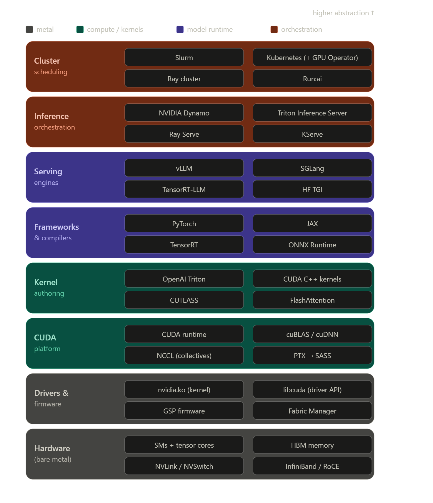

# GPU orchestration

At the very top is [Slurm](https://slurm.schedmd.com/overview.html) : open source cluster management and job scheduling system. It allocates access to resources - provides a framework to execute on nodes - and arbitrates contention for resources.

